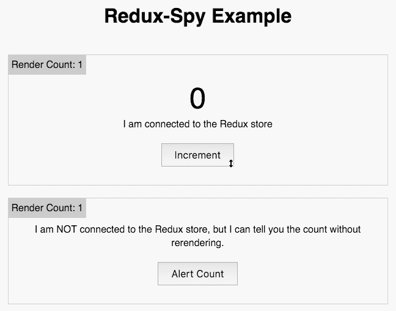

# Redux Spy

`redux-spy` works like `react-redux`'s `connect()` decorator, except that, rather than subscribe 
to changes in the Redux store, which causes a rerender, it gives its wrapped component a function
with which to query specific slices of the Redux store.

It works by using a non-rendering child component that _is_ subscribed to the Redux store.

## Screencast

This is a screencast of the [example app](example) running.



## Example

Say you have a Redux store that looks like:

```js
{
  users: [  // a collection of records maintained by the 'users' reducer
    ...
  ]
}
```

If you had a component that listed all the users, but maybe there are many many users and 
rerendering your list with every change to the users list would be impractical.

```js
import React, { Component } from 'react'
import reduxSpy from 'redux-spy'

class LazyUserList extends Component {
  state = { userList: [] }
  
  update() {
    this.setState({
      userList: this.props.spy('items') // <-- key given to reduxSpy() below
    })
  }
  
  render() {
    const { userList } = this.props
    return (
      <button onClick={() => this.update()}>Update Users</button>
      <ul>
        {userList.map(user => <li key={user.id}>{user.name}</li>)}
      </ul>
    )
  }
}

// decorate the component
LazyUserList = reduxSpy(state => ({ items: state.users }))(LazyUserList)

export default LazyUserList
```

## API

### `reduxSpy(mapStateToKeys)`

> `mapStateToKeys` is very similar to `mapStateToProps` that you would give to `connect()`, except 
it doesn't accept an `ownProps` second parameter.

### Props provided to your decorated component

#### `spy(key:String)` : `Function`

> A function to call to get the corresponding value from the Redux state. The `key` parameter much 
match on the keys in the map returned from `mapStateToKeys`.

